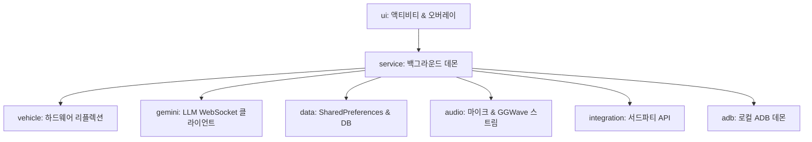

> **언어**: [English](README.md) | **한국어**
> 
> 이 저장소는 BYD 차량용 비공식 음성 비서 클라이언트 프로젝트입니다.

# BYD Sub AI

> **Google Gemini Live, 차량 하드웨어 제어, 저지연 오디오 피드백 및 로컬 ADB 진단 도구를 통합한 BYD 차량용 비공식 음성 비서 에이전트 ('루미')**

---

## ⚠️ Disclaimer (면책 조항)

본 프로젝트는 개인이 학습 및 연구 목적으로 개발한 **비공식, 커뮤니티 주도, 비상업적** 프로젝트입니다. BYD Auto 또는 BYD 본사와는 어떠한 법적·상업적 연관도 없습니다.

**본 소프트웨어의 사용으로 인해 발생하는 모든 책임은 사용자 본인에게 있습니다.** 개발자는 본 프로그램 사용으로 인한 차량 고장, 보증 무효, 데이터 손실 또는 기타 손해에 대해 일체의 책임을 지지 않습니다.

---

## 🚗 차량 플랫폼 지원 현황 및 DiLink 5 안내

- **DiLink 3**: 실차 환경에서 정상 작동 및 검증 완료.
- **DiLink 5 (개발 중 / 기여 환영 🤝)**:
  > ⚠️ **안내**: DiLink 5 지원 코드([`feature/dilink3-dilink5-support`](https://github.com/PoorGrammerA/BydSubAI/tree/feature/dilink3-dilink5-support) 브랜치)는 현재 초기 개발 단계이며, **실제 DiLink 5 차량 환경에서 아직 정상 작동하지 않는 상태**입니다.
  > DiLink 5 차량 환경을 보유하신 개발자분들의 실차 테스트, 디버깅 및 **Pull Request(PR) 기여를 진심으로 환영하고 기다리고 있습니다!**
  >
  > 📋 **TODO**:
  > - DiLink 5 환경에서 AI를 보다 쉽고 직관적으로 호출/실행할 수 있는 방법 모색 (예: 커스텀 버튼 매핑, 핸들 키 가로채기, 플로팅 트리거, 대체 음성 호출 등)

---

## 🏗️ 아키텍처 및 패키지 구조

BYD Sub AI는 오픈소스 기여와 높은 유지보수성을 위해 도메인별 패키지로 모듈화되어 있습니다:



### 주요 패키지 개요:
1. **`ui`**: 사용자 설정 화면, 커스텀 시각화 뷰, 진단 콘솔 액티비티
   - `MainActivity`, `VehicleControlActivity`, `LogViewActivity` (Logcat 콘솔), `SoundSelectActivity`, `AsuradaView`, `KittScannerView`
2. **`service`**: 백그라운드 장기 실행 서비스 및 브로드캐스트 리시버
   - `BydAutoService` (스티어링 휠 트리거 & 센서 알림음 재생기), `GeminiLiveService` (WebSocket 세션 호스트 & 엠비언트 싱크), `BootReceiver`
3. **`vehicle`**: 차량 프라이빗 API 연동 및 리플렉션 계층
   - `VehicleController` (프레임워크 리플렉션 브릿지), `BydAmbientPalette` (31개 프리셋 색상 매칭)
4. **`gemini`**: Google Gemini Live API 양방향 스트리밍 클라이언트
   - `GeminiLiveClient` (실시간 전이중 오디오/툴 호출 클라이언트), `GemmaNewsBriefingHelper`
5. **`data`**: 공유 환경설정 키, 로컬 데이터베이스 헬퍼
   - `ConfigData`, `SecureCredentialStore` (Android KeyStore 암호화), `DestinationDbHelper`
6. **`audio`**: 마이크 오디오 캡처 및 음파 데이터 디코더
   - `AudioPlaybackManager`, `GGWaveReceiver` (음파 신호 디코더), `MicrophoneHandler`
7. **`integration`**: 지도, 날씨, 뉴스 및 외부 앱 실행 도구
   - `MapLauncher` (네이버 지도/티맵 오토), `GoogleNewsRssHelper`, `OpenMeteoWeatherHelper`, `GpsTracker`
8. **`adb`**: 무선 로컬 ADB 통신 데몬
   - `AdbShellExecutor` (`dadb` 기반 자가 권한 획득)

### 외부 도구 애플리케이션 (External Tools)

SubAI는 독립적으로 설치된 외부 Tool APK를 검색하고 사용자의 최초 1회 승인을 거쳐 Gemini Live 세션에 외부 함수를 등록합니다.
- `tool-sdk`: 서드파티 개발자를 위한 안정적인 AIDL 인터페이스와 프로토콜 상수 제공
- [`BydSubAI-KorTools`](https://github.com/PoorGrammerA/BydSubAI-KorTools): 카카오 장소 검색 및 한국 주소 지오코딩을 제공하는 공식 참조 예제(Reference Implementation) 및 컴패니언 앱입니다. 개발자는 이 저장소의 예제 코드를 템플릿 삼아 다른 지도 서비스 검색, 스마트홈 IoT 연동 등 자신만의 커스텀 SubAI 툴을 손쉽게 개발할 수 있습니다.
- [`docs/subai_tool_protocol_v1.ko.md`](docs/subai_tool_protocol_v1.ko.md): 연동 프로토콜, 신뢰 모델, 매니페스트 상세 규격

---

## 🚗 핵심 기능 (Key Features)

### 1. 양방향 실시간 음성 대화 ('루미')
- Gemini의 저지연 실시간 양방향 오디오 스트리밍 API 활용
- 친근하고 자연스러운 한국어 구어체 비서 페르소나
- 캐릭터별 동적 비주얼 패널 연동 (`AsuradaView`, `KittScannerView`)

### 2. 리플렉션 기반 차량 제어 (Function Calling)
음성 명령으로 차량 하드웨어를 직접 제어:
- **공조/에어컨**: 전원, 목표 온도, 풍량, 내외기 순환, 성에 제거, 바람 방향
- **창문 & 루프**: 개별/구역/전체 창문, 선루프, 썬쉐이드 미세 개방률 조절
- **시트 & 스티어링 휠**: 열선 및 통풍 단계 조절
- **오디오**: 시스템 마스터 볼륨 조절 및 음소거
- **내비게이션**: 네이버 지도 / 티맵 오토 실시간 길안내 자동 연동

### 3. 엠비언트 라이트 음성 싱크 (Voice-to-Ambient)
- 루미가 말할 때 목소리 크기에 따라 차량 실내 무드등 밝기가 실시간으로 반응
- 대화 종료 시 원래 기본 밝기와 색상으로 부드럽게 복구

### 4. `SoundPool` 기반 저지연 오디오 엔진
- 센서 알림음의 즉각 반응을 위해 표준 미디어 플레이어 대신 `SoundPool` 적용
- 선택한 캐릭터(루미, 키트, 아스라다)의 오디오 리소스만 선별 로드하여 메모리 절약
- 알림 사운드 간 우선순위 믹싱 관리

### 5. 순차 창문 제어 (Sequential Window Control)
- 다중 창문 동시 구동 시 발생하는 차량 BCM 과전류 보호 락아웃을 방지하기 위해 각 창문을 150ms 간격으로 순차 구동

### 6. 로컬 ADB 자가 권한 획득 (Self Permission Granting)
- 부팅 시 로컬 ADB 포트(`127.0.0.1:5555`)로 접속하여 시스템 진단에 필요한 `READ_LOGS` 권한을 자가 부여

### 7. 고성능 실시간 로그캣 뷰어
- 차량 시스템 로그, SubAI 전용 로그, BYD SDK 로그를 터미널 스타일로 실시간 필터링
- 메모리 버퍼 실시간 녹화 및 파일 내보내기/공유 지원

### 8. 음파를 통한 무선 API 키 등록 (GGwave)
- 스마트폰 화면에서 소리(음파)를 재생하여 차량으로 Gemini API 키를 3초 만에 무선 전송
- 전송된 키는 Android KeyStore(AES/GCM)로 런타임 암호화 보관

---

## 📖 실사용자 가이드 (User Guide & Driver Manual)

> 보다 상세한 실사용 설명은 [docs/user_guide.ko.md](docs/user_guide.ko.md) 문서를 참고하십시오.

### 🎙️ 1. 음성 비서 호출 (Activation Triggers)
- **스티어링 휠 메뉴 버튼**: 핸들 좌측의 **메뉴(Menu) 버튼을 1초 이내에 빠르게 6회 연속 토글**하면 음성 비서가 연결/종료됩니다.
- **런처 바로가기 숏컷**: 홈 화면에 캐릭터별 바로가기 아이콘(**루미, 키트, 아스라다**)을 추가하여 터치 한 번으로 즉시 호출할 수 있습니다.
- **화면 전환 연동**: 특정 화면 전환 브로드캐스트(`ENTER_POWER_SCREEN` ➔ `CLOSE_SCREEN_SAVER`)를 통한 자동 실행을 지원합니다.

### 🧭 2. 목적지 검색 및 길안내 (Navigation & Places)
- **2단계 파이프라인**: 
  1. *"서울역 검색해줘"*, *"스타벅스 찾아줘"* ➔ 외부 Tool 앱([`BydSubAI-KorTools`](https://github.com/PoorGrammerA/BydSubAI-KorTools))의 카카오 API를 통해 정확한 목적지 좌표(WGS84)를 신속 검색.
  2. 좌표 수신 후 SubAI가 **네이버 지도(Naver Map)** 또는 **티맵 오토(TMAP Auto)**를 즉시 실행하여 실시간 경로 안내를 시작합니다.
- **외부 툴 승인**: 한국 장소 검색을 사용하려면 `BydSubAI-KorTools` APK를 설치하고 SubAI에서 최초 1회 승인해야 합니다.

### 🚗 3. 음성 차량 제어 (Voice Vehicle Controls)
- **공조/에어컨**: *"에어컨 22도로 켜줘"*, *"풍량 3단으로 올려줘"*, *"앞유리 성에 제거 켜줘"*
- **시트 & 핸들 열선**: *"운전석 엉따 2단계 켜줘"*, *"조수석 통풍 제일 세게 틀어줘"*, *"핸들 열선 켜줘"*
- **창문 & 선루프 (순차 제어)**: *"창문 다 닫아줘"*, *"앞좌석 창문 반만 열어줘"*, *"선루프 환기 모드로 열어줘"*  
  *(차량 BCM 과전류 차단을 방지하기 위해 각 창문이 150ms 간격으로 순차 작동)*
- **배터리 잔량 & 주행거리**: *"배터리 몇 퍼센트 남았어?"*, *"현재 배터리로 몇 km 갈 수 있어?"*
- **미디어 & 앱**: *"멜론에서 최신곡 틀어줘"*, *"유튜브에서 신나는 음악 틀어줘"*, *"카라오케 켜줘"*

### 🔊 4. 주행 피드백 사운드 & 경사로 주차 안전 경고
- **저지연 피드백**: 기어 변속(P/R/N/D), 크루즈 컨트롤(ACC/ICC), 사각지대 어시스트(BSD), 회생제동 단계, 스포츠 모드 변경 시 선택한 캐릭터(루미/키트/아스라다)의 목소리로 즉시 안내.
- **⚠️ 경사로 주차 안전 경고 (Slope Warning)**: 오르막/내리막 경사로에서 P단으로 주차 시 경사도 센서를 감지하여 차량 밀림 방지를 위한 사이드 브레이크 체결 경고 음성을 재생합니다.

### 📲 5. 음파를 통한 무선 API 키 전송 (GGwave Web Key Sender)
1. 스마트폰 웹 브라우저로 `key-sender` 웹 페이지에 접속합니다.
2. Gemini API 키를 입력하고 **전송(Send)** 버튼을 터치합니다.
3. 스마트폰 스피커에서 초음파/가청 음파 소리가 재생되며, 3~5초 이내에 차량 단말로 무선 전송되어 기기 안전 키스토어에 자동 저장됩니다.

---

## 🛠️ 시작하기 및 빌드 (Getting Started)

### 사전 준비사항
1. **Android Studio & NDK**: GGwave JNI 네이티브 C++ 컴파일을 위한 CMake 및 NDK 설치
2. **API 인증 정보**: Google Gemini API 키

### 프로젝트 빌드
```powershell
.\gradlew assembleDebug
```
컴파일 오류 및 린트 검사:
```powershell
.\gradlew compileDebugJavaWithJavac
```

### 최초 설정 방법
1. 차량 헤드유닛에 빌드된 APK를 설치하고 실행합니다.
2. 로컬 ADB 권한이 필요할 경우 화면의 **ADB 연결 시도** 버튼을 누릅니다.
3. 스마트폰에서 `key-sender` 웹 도구를 열어 음파로 Gemini API 키를 전송하거나 설정 창에서 직접 입력합니다.
4. 장소 검색이 필요할 경우 [`BydSubAI-KorTools`](https://github.com/PoorGrammerA/BydSubAI-KorTools)를 설치하고 승인 다이얼로그를 수락합니다.

---

## 🌐 Web Key Sender (React)
[`key-sender`](key-sender) 디렉토리에 위치한 경량 Vite + React + TypeScript 웹 애플리케이션으로, 차량 화면에서 복잡한 키를 타이핑할 필요 없이 음파 신호로 API 키를 전송합니다.

- 로컬 실행: `cd key-sender && npm install && npm run dev`
- 프로덕션 빌드: `npm run build`

---

## 📄 License
본 프로젝트는 MIT 라이선스에 따라 라이선스가 부여됩니다. 자세한 내용은 [LICENSE](LICENSE) 파일을 참조하십시오.
