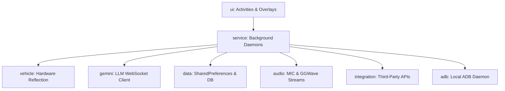

> **Language**: **English** | [한국어 (Korean)](README.ko.md)
> 
> Unofficial voice assistant client ('Lumi') for BYD vehicles integrating Google Gemini Live, vehicle hardware controls, low-latency audio feedback, and local ADB diagnostics.

# BYD Sub AI

> **Unofficial Voice Assistant client ('Lumi') for BYD vehicles integrating Google Gemini Live, Vehicle Controls, Low-Latency Audio, and Local ADB Debugging Tools**

---

## ⚠️ Disclaimer

This is an **unofficial, community-driven, non-commercial** project developed purely for educational and research purposes. It is **NOT** affiliated with, endorsed by, or connected to BYD Auto or BYD Company in any way. 

**Use this software at your own risk.** The developer is not responsible for any vehicle damage, warranty void, malfunction, or data loss caused by using this application.

---

## 🚗 Vehicle Platform Compatibility

- **DiLink 3**: Fully supported and verified on field vehicles.
- **DiLink 5 (Work in Progress / Help Wanted 🤝)**:
  > ⚠️ **Notice**: Experimental support for DiLink 5 (available in the [`feature/dilink3-dilink5-support`](https://github.com/PoorGrammerA/BydSubAI/tree/feature/dilink3-dilink5-support) branch) is currently under active development and **not yet working on actual vehicles**.
  > We warmly welcome testing feedback, debugging assistance, and **Pull Requests (PRs)** from developers with access to DiLink 5 vehicles to help resolve OEM dynamic classloader and permission challenges!

---

## 🏗️ Architecture & Package Structure

BYD Sub AI is structured into domain-specific packages to maintain clean code and high maintainability for open-source contributions:



### Domain Packages Overview:
1. **`ui`**: Encapsulates user settings layouts, custom visualization views, and diagnostics activities.
   - `MainActivity`, `VehicleControlActivity`, `LogViewActivity` (Logcat console), `SoundSelectActivity`, `AsuradaView`, `KittScannerView`
2. **`service`**: Handles long-running background tasks and OS-level receivers.
   - `BydAutoService` (Steering wheel triggers & vehicle sound player), `GeminiLiveService` (WebSocket session host & ambient sync), `BootReceiver`
3. **`vehicle`**: Interfaces with the vehicle's private APIs and reflection layers.
   - `VehicleController` (Reflective framework bridges), `BydAmbientPalette` (31 preset color matching)
4. **`gemini`**: Connects to the Google Gemini Live API and compiles offline briefs.
   - `GeminiLiveClient` (Real-time duplex client), `GemmaNewsBriefingHelper`
5. **`data`**: Houses shared SharedPreferences keys, models, and SQLite data helpers.
   - `ConfigData` (Global preferences keys), `SecureCredentialStore` (Android KeyStore encryption), `DestinationDbHelper`
6. **`audio`**: Captures microphone data and processes data-over-sound signals.
   - `AudioPlaybackManager`, `GGWaveReceiver` (Acoustic signal decoder), `MicrophoneHandler`
7. **`integration`**: Connects weather, maps, news, and system settings helpers.
   - `MapLauncher` (Naver Map & TMAP Auto), `GoogleNewsRssHelper`, `OpenMeteoWeatherHelper`, `GpsTracker`
8. **`adb`**: Connects to the local Android ADB daemon wirelessly using `dadb` to grant system permissions.
   - `AdbShellExecutor`

### External Tool Applications

Sub AI can discover independently installed companion Tool APKs, request one-time user approval, register their function declarations in subsequent Gemini Live sessions, and dispatch calls via Android Binder IPC. Provider credentials remain isolated within each Tool app.

- `tool-sdk`: Stable AIDL interfaces and protocol constants for third-party Tool developers.
- [`BydSubAI-KorTools`](https://github.com/PoorGrammerA/BydSubAI-KorTools): Official reference implementation and companion APK providing Kakao place search and Korean geocoding. Developers can use this repository as a working template to build custom Sub AI tools (e.g., alternative map searches, smart home IoT, or external service integrations).
- [`docs/subai_tool_protocol_v1.md`](docs/subai_tool_protocol_v1.md): Protocol, trust model, manifest format, invocation, and compatibility rules.
- `app/.../tool`: Discovery, approval persistence, schema conversion, Binder dispatch, and Gemini routing.

---

## 🚗 Key Features

### 1. Interactive Real-Time Voice Assistant ('Lumi')
- Uses Gemini's low-latency, real-time voice streaming API (`Google GenAI SDK`).
- Friendly, natural conversational persona.
- Suppresses native vehicle wake words to prevent conflict with built-in car systems.
- Dynamic visual panels (`AsuradaView`, `KittScannerView`) matching the active character persona.

### 2. Reflective Vehicle Hardware Control (Function Calling)
When requested by voice, Gemini invokes function tools mapped to `VehicleController`:
- **Climate / HVAC**: Power, target temperature, fan speed, air circulation (recirculation/fresh air), and defrosters.
- **Windows & Roofs**: Full or percentage controls for side windows, sunroof, and sunshade blind.
- **Seats & Steering Wheel**: Heating and ventilation levels (0–3) and heated steering wheel toggle.
- **Audio Volume**: Master volume adjustments and mute toggle.
- **Navigation**: Launching Naver Map or TMAP Auto with target coordinate locations.

### 3. Ambient Light Voice Synchronization
- **Voice Reactivity**: Syncs Gemini Live voice volume with vehicle ambient light brightness across 6 levels in real time.
- **Auto Recovery**: Automatically resets brightness back to its baseline when speech ends.
- **Palette Presets**: Automatically maps custom colors to the closest matching preset in `BydAmbientPalette` using 3D RGB Euclidean distance.

### 4. Low-Latency Audio Engine (`SoundPool`)
- Replaces heavy media players with `SoundPool` for instantaneous telemetry alerts (gear shifts, BSD, reverse radar, drive mode changes).
- Preloads audio resources only for the currently active character theme (Lumi, KITT, Asurada) to optimize memory and CPU usage.

### 5. Sequential Window Control
- Group window commands operate sequentially with a **150 ms delay** per window to prevent current overload lockouts in the vehicle Body Control Module (BCM).

### 6. Local ADB Integration & Self Permission Granting
- Automatically connects to `127.0.0.1:5555` on startup using `dadb` to grant itself `android.permission.READ_LOGS` without an external PC.

### 7. Real-Time Logcat Console Viewer
- Interactive terminal-style log viewer with dedicated filters for Sub AI logs, BYD SDK logs, and system logs.
- Features in-memory recording and one-tap log export via the Android Share Sheet.

### 8. Acoustic API Key Setup (GGwave)
- Transmits Gemini API credentials and model configurations from a mobile phone to the head unit via acoustic sound waves.
- Credentials are encrypted upon reception using the Android KeyStore (AES-GCM).

---

## 📖 User Guide & Driver Manual

> For the comprehensive guide, see [docs/user_guide.md](docs/user_guide.md).

### 🎙️ 1. Activation Triggers
- **Steering Wheel Menu Button**: Quickly toggle the left steering wheel **Menu button 6 times within 1 second** to connect or disconnect the assistant.
- **Launcher Shortcuts**: Add one-tap launcher shortcut icons for each persona (**Lumi, KITT, Asurada**) to your Android home screen.
- **Screen Transition**: Listens for system screen broadcasts (`ENTER_POWER_SCREEN` ➔ `CLOSE_SCREEN_SAVER`) for automated startup.

### 🧭 2. Navigation & Place Search
- **Two-Stage Pipeline**: 
  1. *"Find a nearby restaurant"* ➔ Companion Tool APK ([`BydSubAI-KorTools`](https://github.com/PoorGrammerA/BydSubAI-KorTools)) queries the Kakao Local API and returns precise geographic coordinates (WGS84).
  2. Sub AI automatically launches **Naver Map** or **TMAP Auto** in live navigation mode.
- **First-Time Approval**: Companion Tool APKs must be approved once via the on-screen prompt in Sub AI.

### 🚗 3. Voice Vehicle Controls
- **HVAC**: *"Set temperature to 22 degrees"*, *"Set fan speed to 3"*, *"Turn on front defroster"*
- **Seats & Wheel**: *"Turn on driver seat warmer to level 2"*, *"Set passenger seat cooling to max"*, *"Turn on steering wheel heater"*
- **Windows & Sunroof**: *"Close all windows"*, *"Open front windows halfway"*, *"Vent the sunroof"*  
  *(Operates sequentially with a 150 ms delay per window for electrical safety)*
- **Battery & Range**: *"What is the remaining battery percentage?"*, *"How many kilometers can we drive?"*
- **Media & Apps**: *"Play my playlist on Melon"*, *"Search driving music on YouTube"*, *"Open Karaoke"*

### 🔊 4. Driving Feedback Sounds & Slope Warning
- **Low-Latency Feedback**: Instantaneous voice confirmations for gear shifts (P/R/N/D), cruise control (ACC/ICC), blind-spot warnings (BSD), and drive mode switches.
- **⚠️ Slope Parking Warning (Slope Warning)**: When parking (shifting to P) on a steep incline, vehicle pitch sensors trigger an immediate voice warning to ensure the parking brake is properly set.

### 📲 5. Wireless API Key Setup (GGwave Web Key Sender)
1. Open the `key-sender` web app on your smartphone browser.
2. Enter your Gemini API key and tap **Send**.
3. A short acoustic sound signal transmits the credentials wirelessly to the vehicle head unit in 3–5 seconds.

---

## 🛠️ Getting Started & Setup

### Prerequisites
1. **Android Studio & NDK**: Ensure C++ support (CMake & NDK) is installed for GGwave JNI library compilation.
2. **API Credentials**: Google Gemini API key.

### Building from Source
```powershell
.\gradlew assembleDebug
```
For checking compilation warnings and linting errors:
```powershell
.\gradlew compileDebugJavaWithJavac
```

### Initial Configuration
1. Install and launch the application on the vehicle head unit.
2. Tap **ADB 연결 시도 (Connect ADB)** if local ADB permissions are required.
3. Transmit Gemini credentials using the Web Key Sender or enter them in the settings menu.
4. (Optional) Install [`BydSubAI-KorTools`](https://github.com/PoorGrammerA/BydSubAI-KorTools) for local place search and approve the provider prompt.

---

## 🌐 Web Key Sender (React)
Located in [`key-sender`](key-sender), this is a lightweight Vite + React + TypeScript web application designed to generate and transmit GGwave sound signals containing API keys to the Android app.

- Local run: `cd key-sender && npm install && npm run dev`
- Production build: `npm run build`

---

## 📄 License
This project is licensed under the MIT License - see the [LICENSE](LICENSE) file for details.
